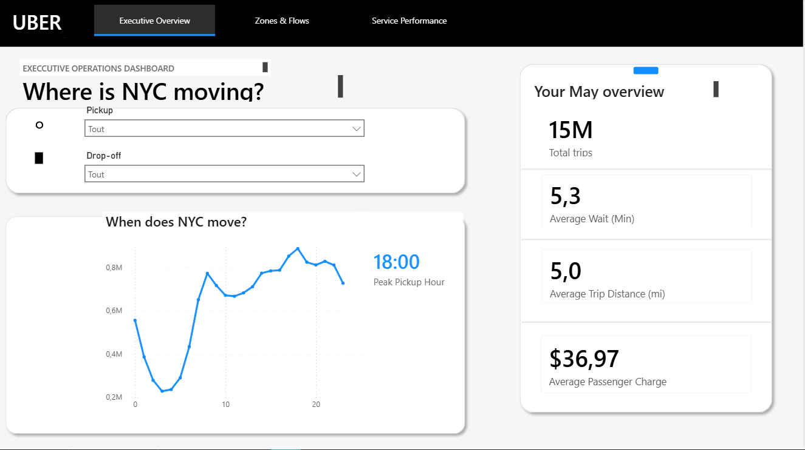
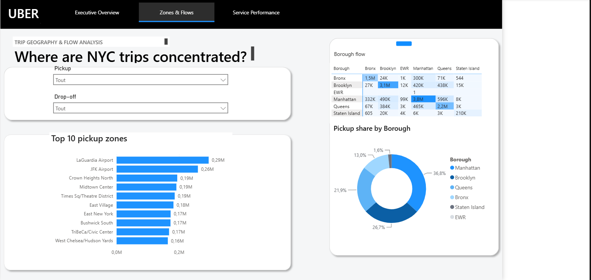
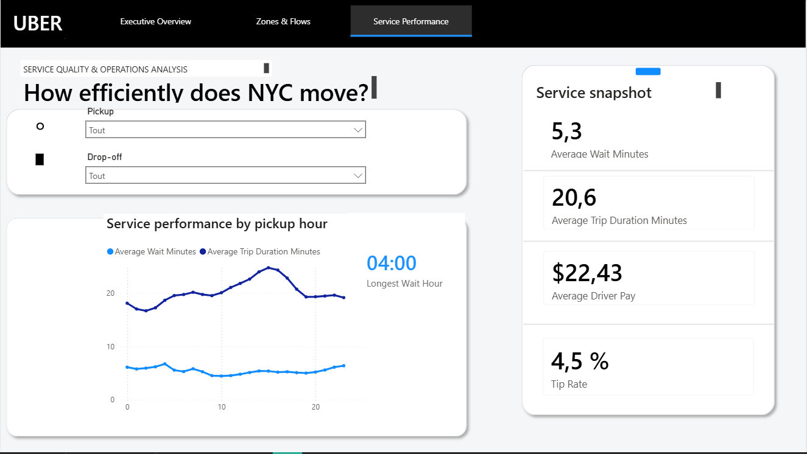

# NYC Rideshare Operations — Power BI

An interactive Power BI report analyzing Uber trip activity across New York City during May 2026.

The project transforms more than 22 million High Volume For-Hire Vehicle trip records into a three-page analytical report covering demand patterns, geographic flows, and service performance.

## Dashboard preview

### Executive Overview

### Zones & Flows

### Service Performance

## Business questions

This project was designed to answer the following questions:

* When is rideshare demand highest during the day?
* Which pickup zones generate the most trips?
* How are trips distributed between NYC boroughs?
* Which borough-to-borough routes have the highest volume?
* How long do passengers wait for pickup?
* How do trip duration, distance, passenger charges, driver pay, and tips vary?

## Report pages

### 1. Executive Overview

Provides a high-level view of monthly operations, including:

* Total trips
* Average passenger wait time
* Average trip distance
* Average passenger charge
* Trips by pickup hour
* Peak pickup hour
* Pickup and drop-off zone filters

### 2. Zones & Flows

Explores the geographic distribution of trips through:

* Top 10 pickup zones
* Pickup share by borough
* Borough-to-borough trip matrix
* Conditional formatting to highlight major travel flows
* Interactive pickup and drop-off zone filters

### 3. Service Performance

Evaluates operational efficiency using:

* Average wait time
* Average trip duration
* Average driver pay
* Tip rate
* Hourly comparison of wait time and trip duration
* Hour with the longest average passenger wait

## Key findings

* Overall pickup demand reaches its highest point around **18:00**.
* **LaGuardia Airport** and **JFK Airport** are the two highest-volume pickup zones.
* **Manhattan** represents the largest share of pickup activity.
* The largest borough flows are trips remaining within the same borough, particularly Manhattan and Brooklyn.
* Average passenger wait time is approximately **5.3 minutes**.
* Average trip duration is approximately **20.6 minutes**.

## Data model

The report uses a star-schema-inspired model containing:

* `FactTrips` — trip-level operational and financial records
* `DimDate` — calendar attributes used for date analysis
* `DimPickupZone` — pickup-zone geography
* `DimDropoffZone` — drop-off-zone geography
* `_Measures` — centralized DAX measures

Pickup and drop-off dimensions are maintained separately so both geographic roles can filter the trip table independently.

## Data preparation

Power Query was used to:

* Import the Parquet trip dataset
* Filter the records used for the Uber analysis
* Select the required operational and financial columns
* Assign appropriate data types
* Create pickup date and hour attributes
* Calculate passenger wait time
* Prepare separate pickup and drop-off zone dimensions
* Remove invalid or unspecified geographic categories

## Measures developed

The report includes DAX measures for:

* Total trips
* Total miles
* Average trip distance
* Average wait time
* Average trip duration
* Total and average passenger charges
* Total and average driver pay
* Total tips
* Tip rate
* Peak pickup hour
* Longest-wait hour
* Borough flow analysis

## Data sources

* NYC TLC High Volume For-Hire Vehicle Trip Records — May 2026
* NYC Taxi Zone Lookup table

Source: [NYC Taxi & Limousine Commission Trip Record Data](https://www.nyc.gov/site/tlc/about/tlc-trip-record-data.page)

## Tools and techniques

* Power BI Desktop
* Power Query
* DAX
* Data cleaning and transformation
* Dimensional data modeling
* KPI development
* Interactive filtering
* Conditional formatting
* Dashboard design and data storytelling

## Repository notes

The raw Parquet dataset and Power BI file are not stored directly in this repository because of their file sizes.

This repository contains the project documentation and dashboard screenshots. A downloadable Power BI file may be provided separately through a GitHub Release.

## Author

Created as part of my data analytics portfolio.

